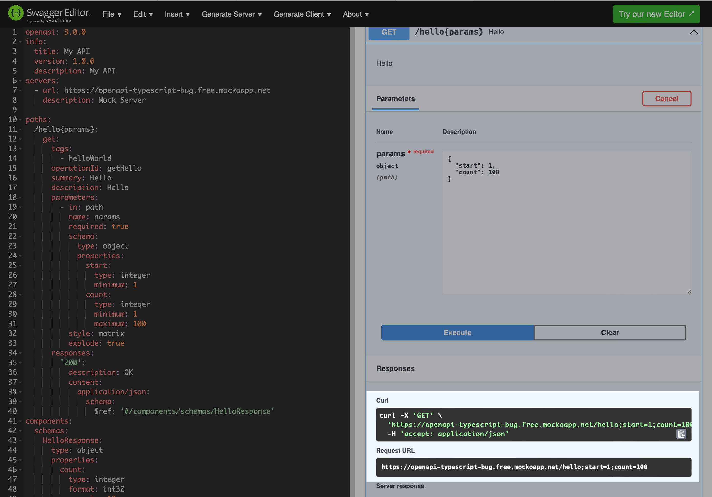

# OpenAPI Generator CLI – Typescript Fetch Bug

This repository contains a minimal example to reproduce a bug in the OpenAPI Generator CLI for the Typescript Fetch client.

## Is there an open issue for this bug?

Yes, see: https://github.com/OpenAPITools/openapi-generator/issues/16153

## What is the bug?

When an API resource uses semi-colon to separate query parameters, the generated client code will not concatenate the query parameters correctly.

Instead of `https://openapi-typescript-bug.free.mockoapp.net/hello;count=10;start=20` the generated client code will produce `https://openapi-typescript-bug.free.mockoapp.net/hello[object Object]`.

This is caused [by the apis.mustache template file](https://github.com/dschu-lab/openapi-generator/blob/fdf53ac01e5aee9f4b8117a54b25e723b3524a34/modules/openapi-generator/src/main/resources/typescript-fetch/apis.mustache#L262), which generates the following code to concatenate the request parameters:

```typescript
path: `/hello{params}`.replace(`{${"params"}}`, encodeURIComponent(String(requestParameters.params))),
```

But since `requestParameters.params` is an object, the `encodeURIComponent` function will convert it to the string `[object Object]`.

## How to reproduce the bug?

1. Clone this repository
2. Run `npm install`
3. Run `npm run generate` to generate the client code
4. Run `npm run execute` to execute the example query
5. Notice the output in the console will contain an incorrect url: `https://openapi-typescript-bug.free.mockoapp.net/hello[object Object]`

## Is this reproducible in the online swagger editor?

No, the Swagger UI concatenates the query parameters correctly:

